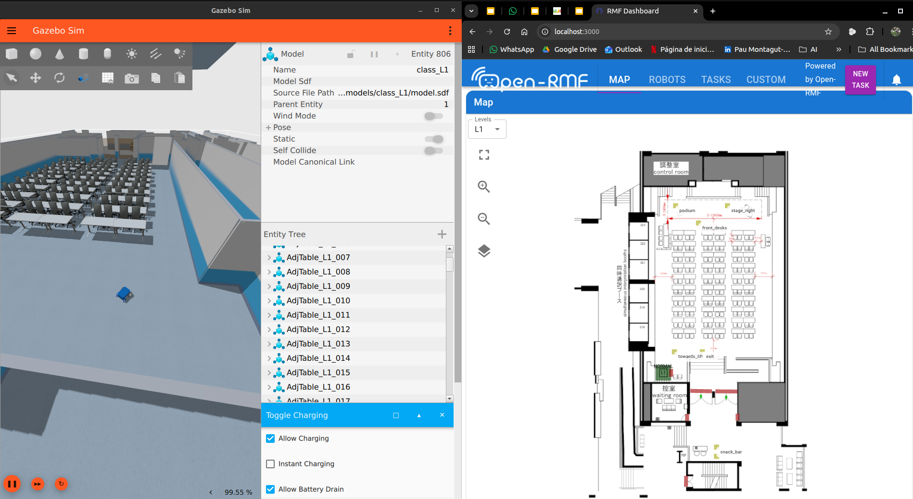
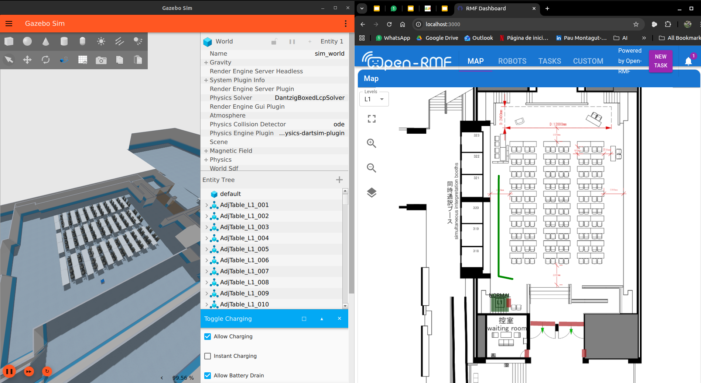
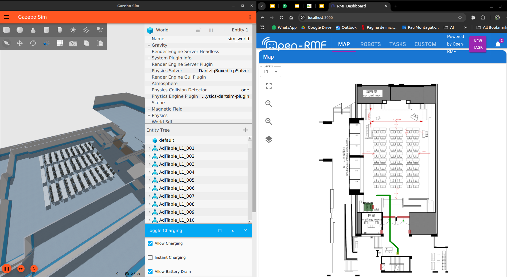
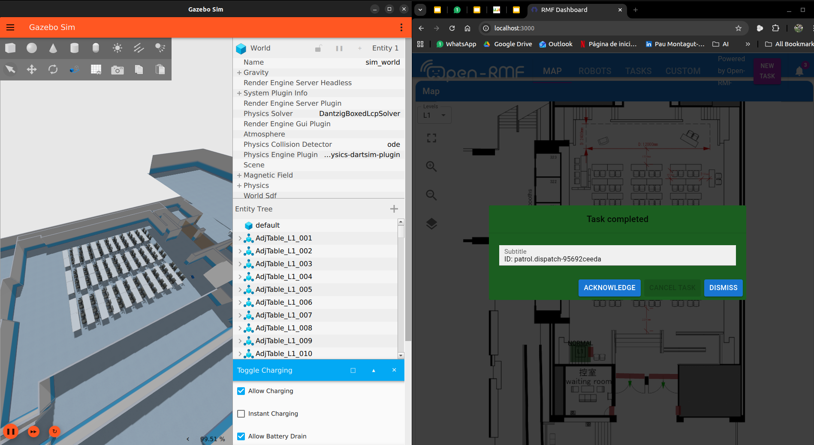

# First Project with Open-RMF

An Open-RMF project with two simulation worlds (**test1** and **ICC Kyoto**), featuring a TinyRobot fleet managed through a custom fleet adapter, a Gazebo simulation, and the RMF web dashboard.

## Project Structure

```
src/project/
  project_assets/        # Robot and environment 3D models (TinyRobot, etc.)
  project_config/        # Launch and config files per world (fleet params, nav graphs)
  project_fleet_adapter/  # Python fleet manager (FastAPI) + fleet adapter (rmf_easy)
  project_maps/          # Building YAMLs, Gazebo worlds, meshes and nav graphs
  project_simulation/    # Top-level simulation launch files
fix_lift.py              # Patch script for a known LiftPlugin segfault (see Troubleshooting)
```

## Prerequisites

Pull the required Docker images:

```bash
docker pull ghcr.io/open-rmf/rmf/rmf_demos:jazzy-rmf-latest
docker pull ghcr.io/open-rmf/rmf-web/api-server:jazzy-nightly
docker pull ghcr.io/open-rmf/rmf-web/demo-dashboard:jazzy-nightly
```

You also need [rocker](https://github.com/osrf/rocker) for GPU and X11 forwarding:

```bash
pip install rocker
```

## Setup

### 1. Start the RMF container

From your **home directory** (`~`), run:

```bash
rocker --nvidia --x11 --network host --name rmf_demos --user --home \
  --volume "$(pwd)/rmf-ws:/home/$USER/rmf_ws" \
  -- ghcr.io/open-rmf/rmf/rmf_demos:jazzy-rmf-latest bash
```

> **Note:** If you cloned this repo to a different path, adjust the `--volume` mount so that the `First Project/` folder is accessible inside the container as a colcon workspace. For example:
> ```bash
> --volume "/path/to/First Project:/home/$USER/rmf_ws"
> ```

### 2. Fix GPU permissions (if needed)

Inside the container, if Gazebo fails with `/dev/dri/renderD128: Permission denied`:

```bash
sudo chmod 666 /dev/dri/*
```

### 3. Build the workspace

Inside the container:

```bash
source /rmf_demos_ws/install/setup.bash
cd ~/rmf_ws
colcon build
source install/setup.bash
```

## Launching the Simulations

### Option A: Simple World (test1)

This is a basic two-floor building with a single TinyRobot.

**Terminal 1** (inside the container) -- Start the API server first (from host):

```bash
docker run --rm --network host \
  -e RMF_API_SERVER_CONFIG='{"host":"0.0.0.0","port":8000,"log_level":"warning"}' \
  ghcr.io/open-rmf/rmf-web/api-server:jazzy-nightly
```

**Terminal 2** (inside the container) -- Launch the simulation:

```bash
source ~/rmf_ws/install/setup.bash
ros2 launch project_simulation test1.launch.xml server_uri:="ws://localhost:8000/_internal"
```

**Terminal 3** (from host) -- Start the dashboard:

```bash
docker run --rm --network host \
  -e REACT_APP_TRAJECTORY_SERVER_URL="ws://localhost:8006" \
  -e RMF_SERVER_URL="http://localhost:8000" \
  ghcr.io/open-rmf/rmf-web/demo-dashboard:jazzy-nightly
```

Open the dashboard at **http://localhost:3000**.

### Option B: ICC Kyoto World

This is a more complex world based on the ICC Kyoto conference center, with doors, a lift, and multiple waypoints.

**Terminal 1** (from host) -- Start the API server:

```bash
docker run --rm --network host \
  -e RMF_API_SERVER_CONFIG='{"host":"0.0.0.0","port":8000,"log_level":"warning"}' \
  ghcr.io/open-rmf/rmf-web/api-server:jazzy-nightly
```

**Terminal 2** (inside the container) -- Launch the simulation:

```bash
source ~/rmf_ws/install/setup.bash
ros2 launch project_simulation icc_kyoto.launch.xml server_uri:="ws://localhost:8000/_internal"
```

**Terminal 3** (from host) -- Start the dashboard:

```bash
docker run --rm --network host \
  -e REACT_APP_TRAJECTORY_SERVER_URL="ws://localhost:8006" \
  -e RMF_SERVER_URL="http://localhost:8000" \
  ghcr.io/open-rmf/rmf-web/demo-dashboard:jazzy-nightly
```

Open the dashboard at **http://localhost:3000**.

### Sending Tasks via the Dashboard

Once the robot appears in the dashboard, you can dispatch tasks such as:

- **Patrol (Loop):** Send the robot to patrol between two waypoints (e.g., `podium` -> `snack_bar` -> `podium`).
- **Delivery:** Request a pickup at `snack_bar_pickup` and dropoff at another waypoint.

You can also dispatch tasks via CLI:

```bash
# Patrol task: robot loops between two waypoints
ros2 run rmf_demos_tasks dispatch_patrol \
  -p podium -p snack_bar -p stage_right -p podium \
  --use_sim_time
```

## Screenshots

### Dashboard overview

Gazebo simulation (left) running the ICC Kyoto world side-by-side with the RMF Dashboard (right) showing the building map, the robot position, and the fleet status.



### Patrol Task 1

A patrol task is dispatched. The planned route is drawn on the dashboard map, and the robot begins navigating along the assigned waypoints.



### Patrol Task 2

A second patrol task with a different set of waypoints. The robot follows the new route through the building corridors.



### Task Completed

The dashboard confirms that the dispatched task has been completed successfully.



## Troubleshooting

### 1. Gazebo crashes with Segmentation Fault in LiftPlugin

**Problem:** The ICC Kyoto world includes a lift, and the `LiftPlugin` from `rmf_building_sim_gz_plugins` crashes with a segfault. The root cause is a bug where `enableComponent<AxisAlignedBox>()` is called inside an `ecm.Each()` iteration loop, which modifies the Entity Component Manager while iterating over it, corrupting the internal iterator.

**Solution:** We patched the lift plugin source code. The `fix_lift.py` script automates the patch. Inside the container:

```bash
cd ~/
git clone https://github.com/open-rmf/rmf_simulation.git -b main
python3 ~/rmf_ws/fix_lift.py \
  ~/rmf_simulation/rmf_building_sim_gz_plugins/src/lift.cpp
cd ~/rmf_simulation
source /rmf_demos_ws/install/setup.bash
colcon build --packages-select rmf_building_sim_gz_plugins
source install/setup.bash
```

Then re-launch the simulation from the same terminal.

### 2. Fleet adapter fails to connect / Robot does not appear in dashboard

**Problem:** The fleet adapter crashes at startup or fails to report robot state. The API server shows the fleet registered but with `"robots": {}`.

**Root cause:** Two bugs in `RobotClientAPI.py`:
1. The fleet manager (FastAPI) defines its routes with trailing slashes (e.g., `/status/`), but the fleet adapter client called them without trailing slashes (e.g., `/status?robot_name=...`). FastAPI returns a 307 redirect which can lose query parameters.
2. The `get_data()` method did not check the `success` field in the response. When the fleet manager has not yet received robot state from Gazebo (normal at startup), it returns `{"data": {}, "success": false}`. The adapter then tried to parse the empty dict, causing a `KeyError: 'robot_name'`.

**Solution:** Fixed in `RobotClientAPI.py` by adding trailing slashes to all URL endpoints and checking `response.json()['success']` before parsing the data.

### 3. Missing `is_charger` flag on the charger waypoint

**Problem:** The fleet config (`tinyRobot_config.yaml`) sets `charger: "podium"` but the navigation graph did not have the `is_charger: true` property on the podium vertex.

**Solution:** Added `is_charger: true` to the podium vertex in `nav_graphs/0.yaml`.

### 4. GPU permission denied in container

**Problem:** Gazebo fails with `Permission denied` on `/dev/dri/renderD128` or `/dev/dri/renderD129`.

**Solution:**
```bash
sudo chmod 666 /dev/dri/*
```

### 5. Stale CMake cache after moving the workspace

**Problem:** `colcon build` fails with errors about paths not matching if the workspace was previously built at a different path (e.g., moving from `rmf_ws` to `rmf-ws`).

**Solution:** Delete the build directory for the affected package and rebuild:
```bash
rm -rf build/<package_name>
colcon build
```
