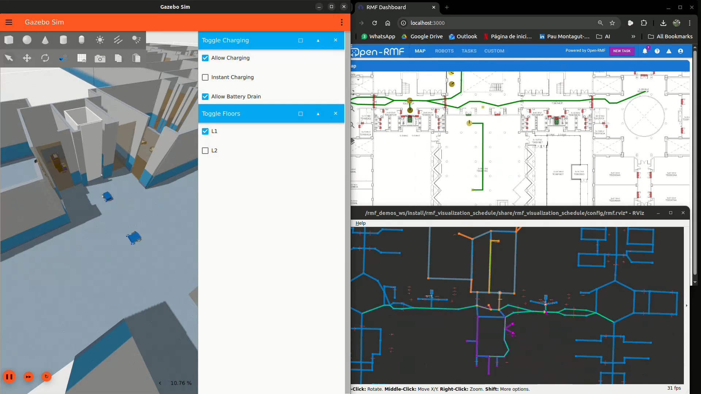
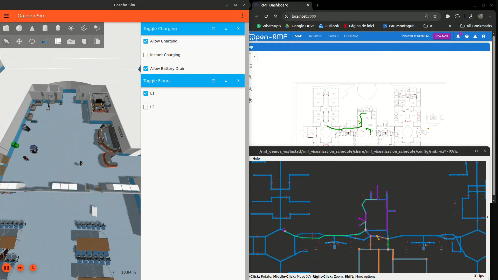
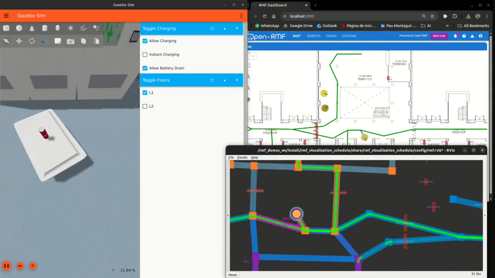

# Large Project — ESTCE Open-RMF

Simulacion del edificio ESTCE (Escola Superior de Tecnologia i Ciencies Experimentals)
con Open-RMF. Tres flotas de robots autonomos (patrulla, limpieza y entrega) coordinados
por RMF en un edificio de 2 plantas con puertas, ascensores y zonas de carga.

**Stack:** ROS 2 Jazzy + Gazebo Harmonic + Open-RMF + Dashboard web

## Demo

<p align="center">
  
</p>

Ejemplo lanzando una tarea de cada tipo (patrol, clean, delivery) y mostrando como
los robots interactuan con los diferentes elementos del edificio: ascensores, puertas
automaticas y dispensadores. Video acelerado a x15 porque los robots iban muy lentos
en la simulacion, probablemente por los recursos limitados del PC (el world tiene
~1580 modelos y consume mucha CPU/GPU).

### Patrol

<p align="center">
  
</p>

### Clean

<p align="center">
  
</p>

### Delivery

<p align="center">
  
</p>

---

## Requisitos

- **Docker** (version 20+)
- **NVIDIA Container Toolkit** ([guia de instalacion](https://docs.nvidia.com/datacenter/cloud-native/container-toolkit/latest/install-guide.html))
- **rocker** (`pip install rocker`)
- **GPU NVIDIA** con drivers instalados

### Imagenes Docker

```bash
docker pull ghcr.io/open-rmf/rmf/rmf_demos:jazzy-rmf-latest
docker pull ghcr.io/open-rmf/rmf-web/api-server:jazzy-nightly
docker pull ghcr.io/open-rmf/rmf-web/demo-dashboard:jazzy-nightly
```

### Swap de 16 GB

El world tiene ~1580 modelos y Gazebo consume mucha RAM. Sin swap el sistema se puede quedar sin memoria.

```bash
sudo fallocate -l 16G /swapfile
sudo chmod 600 /swapfile
sudo mkswap /swapfile
sudo swapon /swapfile
echo '/swapfile none swap sw 0 0' | sudo tee -a /etc/fstab
```

---

## Setup (solo la primera vez)

### 1. Clonar y copiar al workspace

```bash
git clone <url-del-repo> IR2134-Robots-Cooperatius
cd IR2134-Robots-Cooperatius

mkdir -p ~/rmf-ws/src
cp -r "Large Project/src/project" ~/rmf-ws/src/
cp "Large Project/download_fuel_models.sh" ~/rmf-ws/
cp "Large Project/setup_fuel_symlinks.sh" ~/rmf-ws/
cp "Large Project/fix_lift.py" ~/rmf-ws/
```

### 2. Crear el contenedor

```bash
rocker --nvidia=gpus --x11 --user --home \
  --name rmf_demos \
  --network host \
  -- ghcr.io/open-rmf/rmf/rmf_demos:jazzy-rmf-latest bash
```

> `--network host` es necesario para que simulacion, API server y dashboard se comuniquen.

**Todo lo que viene a continuacion se ejecuta dentro del contenedor.**

### 3. Descargar modelos de Fuel

```bash
cd ~/rmf-ws
bash download_fuel_models.sh
bash setup_fuel_symlinks.sh
```

### 4. Parchear plugin de ascensores

```bash
cd ~/rmf-ws
LIFT_CPP=$(find /rmf_demos_ws/src -name "lift.cpp" -path "*/rmf_building_sim_gz_plugins/*" 2>/dev/null)
if [ -z "$LIFT_CPP" ]; then
  LIFT_CPP=$(find / -name "lift.cpp" -path "*/rmf_building_sim_gz_plugins/*" 2>/dev/null | head -1)
fi
python3 fix_lift.py "$LIFT_CPP"

source /opt/ros/jazzy/setup.bash
cd /rmf_demos_ws
colcon build --packages-select rmf_building_sim_gz_plugins
```

### 5. Compilar el workspace

```bash
source ~/rmf_ws/install/setup.bash
cd ~/rmf-ws
colcon build --symlink-install \
  --packages-select project_assets project_config project_fleet_adapter \
  project_maps project_simulation \
  --paths src/project/*
```

> Usamos `source ~/rmf_ws/install/setup.bash` porque encadena Jazzy + los paquetes
> RMF del contenedor. Si usas solo `/opt/ros/jazzy/setup.bash`, luego no encontrara
> los paquetes RMF al hacer source.

---

## Lanzar la simulacion

3 terminales, en este orden:

### Terminal 1 — API Server (en el host)

```bash
docker run --network host --rm -it \
  -e ROS_AUTOMATIC_DISCOVERY_RANGE=LOCALHOST \
  -e RMW_IMPLEMENTATION=rmw_cyclonedds_cpp \
  ghcr.io/open-rmf/rmf-web/api-server:jazzy-nightly
```

### Terminal 2 — Simulacion (dentro del contenedor)

```bash
docker exec -it rmf_demos bash
```

```bash
export __NV_PRIME_RENDER_OFFLOAD=1
export __GLX_VENDOR_LIBRARY_NAME=nvidia
export RMW_IMPLEMENTATION=rmw_cyclonedds_cpp
export ROS_AUTOMATIC_DISCOVERY_RANGE=LOCALHOST
source ~/rmf_ws/install/setup.bash
source ~/rmf-ws/install/local_setup.bash
export GZ_SIM_RESOURCE_PATH=$GZ_SIM_RESOURCE_PATH:~/rmf-ws/fuel_models

ros2 launch project_simulation estce.launch.xml \
  sim_update_rate:=50 \
  server_uri:=ws://localhost:8000/_internal
```

> Las variables `__NV_PRIME_RENDER_OFFLOAD` y `__GLX_VENDOR_LIBRARY_NAME` fuerzan
> la GPU NVIDIA. Sin ellas RViz2 no abre ventana.

> Para lanzar sin GUI (mas ligero): anadir `headless:=true`.

### Terminal 3 — Dashboard web (en el host)

```bash
docker run --network host --rm -it \
  -e RMF_SERVER_URL=http://localhost:8000 \
  -e TRAJECTORY_SERVER_URL=ws://localhost:8006 \
  ghcr.io/open-rmf/rmf-web/demo-dashboard:jazzy-nightly
```

Abrir en el navegador: **http://localhost:3000**

---

## Despachar tareas

Desde el dashboard web o por CLI (en otra terminal dentro del contenedor):

```bash
docker exec -it rmf_demos bash
export RMW_IMPLEMENTATION=rmw_cyclonedds_cpp
export ROS_AUTOMATIC_DISCOVERY_RANGE=LOCALHOST
source ~/rmf_ws/install/setup.bash
source ~/rmf-ws/install/local_setup.bash
```

```bash
# Patrol (ronda entre waypoints)
ros2 run rmf_demos_tasks dispatch_patrol \
  -p patrol_charger_1 patrol_charger_2 -n 3 --use_sim_time

# Clean (limpiar una zona)
ros2 run rmf_demos_tasks dispatch_clean \
  -cs clean_hall --use_sim_time

# Delivery (recoger y entregar)
ros2 run rmf_demos_tasks dispatch_delivery \
  -p pickup_point -ph coke_dispenser \
  -d dropoff_point -dh coke_ingestor --use_sim_time
```

---

## Editar el mapa

```bash
rocker --nvidia=gpus --x11 --user --home \
  --name traffic-editor \
  --network host \
  -- ghcr.io/open-rmf/rmf/rmf_demos:jazzy-rmf-latest traffic-editor
```

Abrir `~/rmf-ws/src/project/project_maps/maps/estce/estce.building.yaml`.

Despues de guardar, regenerar y recompilar dentro del contenedor:

```bash
source ~/rmf_ws/install/setup.bash
cd ~/rmf-ws/src/project/project_maps/maps/estce

ros2 run rmf_building_map_tools building_map_generator gazebo \
  estce.building.yaml estce.world ./models

ros2 run rmf_building_map_tools building_map_generator nav \
  estce.building.yaml nav_graphs/

cd ~/rmf-ws
colcon build --symlink-install \
  --packages-select project_maps --paths src/project/*
```

---

## Flotas

| Flota | Robot | Cantidad | Graph | Planta | Puerto |
|-------|-------|----------|-------|--------|--------|
| patrol_fleet | TinyRobot | 4 (2 en L1, 2 en L2) | 0 | L1 + L2 | 22012 |
| cleaner_fleet | CleanerBotA | 2 | 3 | L1 | 22013 |
| delivery_fleet | DeliveryRobot | 2 | 1 | L1 | 22014 |

---

## Estructura del proyecto

```
src/project/
├── project_assets/             # Modelos 3D de los robots
├── project_config/
│   ├── launch/
│   │   ├── common.launch.xml   # Nodos RMF comunes
│   │   └── estce.launch.xml    # Config de las 3 flotas
│   └── config/estce/
│       ├── patrol_fleet_config.yaml
│       ├── cleaner_fleet_config.yaml
│       └── delivery_fleet_config.yaml
├── project_fleet_adapter/      # Fleet adapter (FastAPI + ROS 2)
├── project_maps/
│   └── maps/estce/
│       ├── estce.building.yaml # Fuente de verdad (Traffic Editor)
│       ├── estce.world         # Generado (NO editar)
│       └── nav_graphs/         # Generados (NO editar)
└── project_simulation/
    └── launch/
        ├── estce.launch.xml
        └── simulation.launch.xml
```
